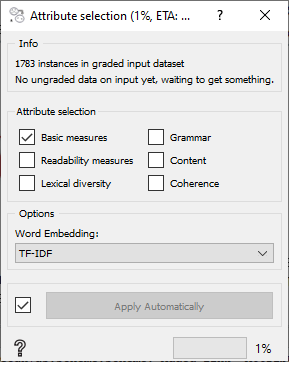
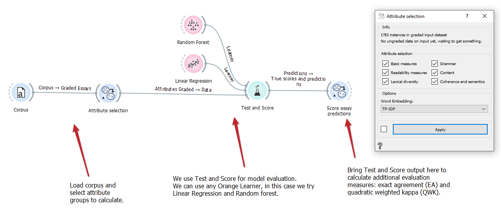

Attribute selection
===================

Calculate attributes based on essay grading system (Zupanc and Bosnić).
Provides options to choose among AGE system groups, as well as the AGE+ group (coherence).

**Inputs**
-  Graded essays: Corpus of graded essays.
-  Ungraded essays: Corpus of ungraded essays.
-  Source text: Optional file with source text (text the essays are based on).

**Outputs**
-  Graded attributes: Attributes for graded essay corpus.
-  Ungraded attributes: Attributes for ungraded essay corpus.

**Attribute selection** widget gives us the option to select and calculate desired attributes from input essays. All essay inputs are of type 'Corpus' (from Orange-text), while outputs and source text input are of type 'DataTable'. We can then use these outputs in a standard Orange fashion (models, predictions ...).

1. Select desired attributes

   - Select desired attributes using the available checkboxes
   - There are 6 categories of attributes which include over 70 attributes in total
        - Basic measures:
            - Number of characters (with spaces)
            - Number of characters (without spaces)
            - Number of words
            - Number of short words
            - Number of long words
            - Most frequent word length
            - Average word length
            - Number of sentences
            - Number of short sentences
            - Number of long sentences
            - Most frequent sentence length
            - Average sentence length
            - Number of different words
            - Number of stopwords
        - Readability measures:
            - Gunning Fog index
            - Flesch reading ease index
            - Flesch Kincaid grade
            - Dale Chall readability formula
            - Automated readability index
            - Simple measure of Gobbledygook
            - LIX
            - Word variation index
            - Nominal ratio
        - Lexical diversity:
            - Type-token ration
            - Guiraud's index
            - Yule's K
            - The D estimate
            - Hapax legomena
            - Advanced Guiraud's index
        - Grammar:
            - Number of each different POS tag (~30 attributes)
            - Average sentence structure tree height
            - Number of verbs
        - Content:
            - Number of spellchecking errors
            - Number of capitalization errors
            - Number of punctuation errors
            - Cosine similarity with source text (if source text present)
            - Grade that the current essay's cosine similarity is most similar to
            - Cosine similarity with best essays
            - Cosine pattern
            - Cosine correlation values
        - Coherence (AGE+):
            - Avg/min/max distance to neighbouring points (2x, euc. and cos. distance)
            - Avg/min/max distance to any point (2x, euc. and cos. distance)
            - Clark Evans nearest neighbour
            - Average distance of nearest neighbour
            - Cumulative frequency <!--Frequency TODO-->
            - Avg/min/max distance to centroid (2x, euc. and cos. distance)
            - Standard distance
            - Relative distance
            - Determinant of distance matrix
            - Moran's I
            - Geary's C
            - Gettis' G

2. Select word embeddings:

   - Word embeddings are used during calculations of 'Content' and 'Coherence' attributes
   - Choose 'TF-IDF' or 'GloVe' (SpaCy and Flair implementations available) word embeddings

3. The calculation may take a few minutes, depending on attribute categories selected. 'Grammar', 'Content' and 'Coherence' are most demanding.

4. Due to speed, selection changes are NOT communicated automatically. You can change this by ticking the checkbox next to 'Apply' button.

Examples
--------

In the below example we put our training set corpus on the "graded essays" input. 
We calculate all attributes (using TF-IDF) and do 10-fold cross-validation in "Test and Score" widget.
Quadratic weighted kappa is calculated in "Score essay predictions" widget.

If we have a defined train set beforehand, we would put the training set on "graded essays" input and the test set on "ungraded essays" input.
The difference is in calculations of some attributes, as some require knowledge of best graded essays ('training set') for comparison.

References
----------

Zupanc, Kaja, and Zoran Bosnić. "Automated essay evaluation with semantic analysis." Knowledge-Based Systems 120 (2017): 118-132.

Zupanc, Kaja, and Zoran Bosnic. "Advances in the field of automated essay evaluation." Informatica 39.4 (2016).

Zupanc, Kaja, and Zoran Bosnic. "Automated essay evaluation augmented with semantic coherence measures." 2014 IEEE International Conference on Data Mining. IEEE, 2014.
