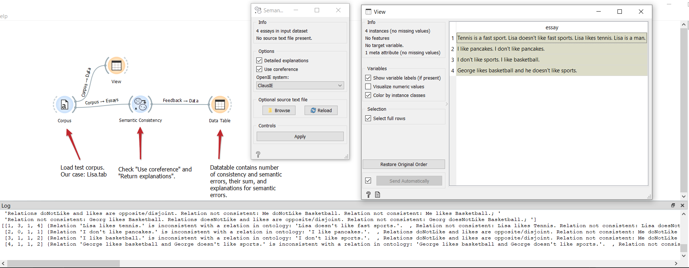

Semantic consistency
=======

Show data points on a world map.

**Inputs**
-  Essays: Essay corpus.

**Outputs**
-  Feedback: Feedback on essays and error/inconsistency explanations.

**Semantic consistency** widget checks for semantic consistency of the essays. It achieves that by converting sentences into triples (via OpenIE) and inserts them into an ontology. Logic reasoner is then used to determine potential inconsistencies in said ontology. Widget logs number of different errors. For improved accuracy, coreference resolution may be used. Additionaly, a 'source text' file can be selected, which contains information essays are based on. *PROCESSING OF THIS WIDGET IS VERY SLOW*

TODO slika <!--  -->

1. Input essay corpus.

2. Select desired OpenIE system:

    - ClausIE is a lot faster, but somewhat less accurate
    - OpenIE5.0 is more accurate, but slower; it also requires additional setup (downloading large model files)
    
    
3. Check 'Use coreferences' if coreference resolution is needed.

4. If the option is not selected, only the general inconsistent sentences will be returned.
If the option is selected, more detailed will be returned by using the logic reasoner's explanation feature which tries to figure out the concepts that cause the inconsistency.

5. Apply. Note that processing of this widget may take a long time.

Examples
--------

In below example, we loaded the "Lisa.tsv" dataset and connected it to SemanticConsistency.
We selected the "Use coreferences" option and "Detailed explanations" option.
The first one will help us correctly resolve references like "he" and "she".
Detailed explanations will return detailed description of inconsistencies.
You can see the List.tsv input in the "View" windows and the reutrend explanations in the bottom "Log" window.

<!--
TODO
In the first example we will model class predictions on a map. We will use *philadelphia-crime* data set, load it with **File** widget and connect it to **Map**. We can already observe the mapped points in Map. Now, we connect **Tree** to Map and set target variable to Type. This will display the predicted type of crime for a specific region of Philadelphia city (each region will be colored with a corresponding color code, explained in a legend on the right).

The second example uses [global-airports.csv](https://raw.githubusercontent.com/ajdapretnar/datasets/master/data/global_airports.csv) data. Say we somehow want to predict the altitude of the area based soley on the latitude and longitude. We again load the data with **File** widget and connect it to Map. Then we use a regressor, say, **kNN** and connect it to Map as well. Now we set target to altitude and use Black and White map type. The model guessed the Himalaya, but mades some errors elsewhere.

-->