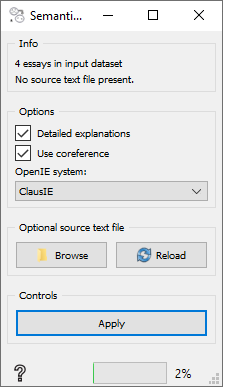

Semantic consistency
====================

Calculates three (3) attributes based on SAGE system for essay grading and provides feedback (Zupanc and Bosnić, 2017; Zupanc, 2018)

**Inputs**
-  Essays: Essay corpus.

**Outputs**
-  Feedback: Feedback on essays and error/inconsistency explanations.

**Semantic consistency** widget checks for semantic consistency of the essays. It achieves that by converting sentences into triples (via OpenIE) and inserts them into an ontology. Logic reasoner is then used to determine potential inconsistencies in said ontology. Widget logs number of different errors. For improved accuracy, coreference resolution may be used. Additionaly, a 'source text' file can be selected, which contains information essays are based on. *PROCESSING OF THIS WIDGET IS VERY SLOW*

1. Input essay corpus.

2. Select desired OpenIE system:

    - ClausIE is a lot faster, but somewhat less accurate
    - OpenIE5.0 is more accurate, but slower; it also requires additional setup (downloading large model files)
    
    
3. Check 'Use coreferences' if coreference resolution is needed.

4. If the option is not selected, only the general inconsistent sentences will be returned.
If the option is selected, more detailed will be returned by using the logic reasoner's explanation feature which tries to figure out the concepts that cause the inconsistency.

5. Apply. Note that processing of this widget may take a long time.

Examples
--------

In below example, we loaded the "Lisa.tsv" dataset and connected it to SemanticConsistency.
We selected the "Use coreferences" option and "Detailed explanations" option.
The first one will help us correctly resolve references like "he" and "she".
Detailed explanations will return detailed description of inconsistencies.
You can see the List.tsv input in the "View" windows and the reutrend explanations in the bottom "Log" window.

References
----------

Zupanc, Kaja, and Zoran Bosnić. "Automated essay evaluation with semantic analysis." Knowledge-Based Systems 120 (2017): 118-132.

Zupanc, Kaja, and Zoran Bosnic. "Advances in the field of automated essay evaluation." Informatica 39.4 (2016).

Zupanc, Kaja, and Zoran Bosnic. "Automated essay evaluation augmented with semantic coherence measures." 2014 IEEE International Conference on Data Mining. IEEE, 2014.
